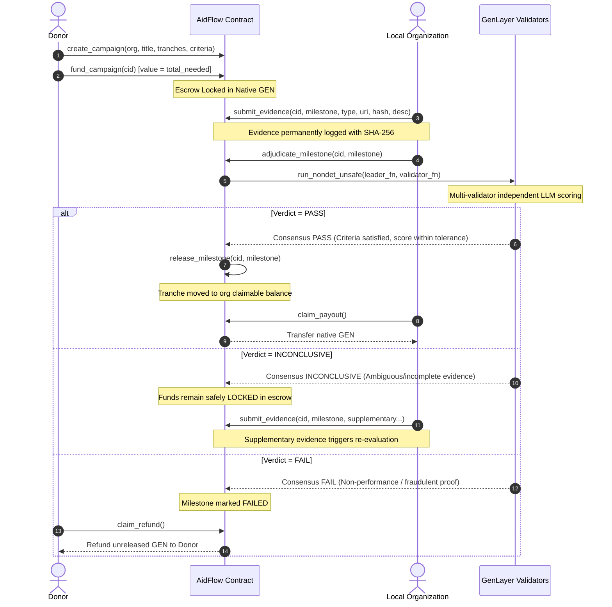

# AidFlow

**Autonomous humanitarian aid escrow powered by GenLayer.**

> *"Fund outcomes. Verify impact. Release capital."*

[-blue)](https://studio.genlayer.com/api)
[](contracts/aidflow.py)
[-brightgreen)](contracts/aidflow.py)
[](tests/direct/test_aidflow.py)
[-black)](frontend/)

---

## PROJECT OVERVIEW

Humanitarian aid funding faces a fundamental accountability dilemma. Billions of dollars are committed annually to crisis response and community relief, but donors face significant difficulty verifying whether promised real-world outcomes were actually achieved.

Traditional grant frameworks suffer from two flawed extremes:
1. **Upfront Unconditional Disbursement**: Funds are transferred before work begins, exposing capital to embezzlement, misallocation, or project abandonment.
2. **Post-Hoc Bureaucratic Auditing**: Funds are withheld pending extensive off-chain manual auditing, creating months of administrative delay that paralyzes frontline relief workers.

AidFlow introduces **conditional on-chain humanitarian escrow**. Capital is locked in native GEN and disbursed sequentially as milestones are substantively validated by GenLayer's decentralized consensus:

```
DONOR
  ↓ (Payable GEN)
ESCROW
  ↓ (Perform Milestone Work)
LOCAL ORGANIZATION
  ↓ (Submit Multi-Modal Proof)
EVIDENCE
  ↓ (Independent LLM Evaluation)
GENLAYER VALIDATORS
  ↓ (Consensus on Substantive Verdict)
PASS / FAIL / INCONCLUSIVE
  ↓
RELEASE / HOLD / REFUND
```

AidFlow is **not** an AI chatbot making subjective decisions on a server. It is a verifiable protocol combining:
* **Programmable Escrow**: On-chain funds locked until cryptographically settled.
* **Predefined Milestone Criteria**: Clear, contractual performance benchmarks agreed upon at campaign inception.
* **Multi-Modal Evidence Submission**: IPFS references, delivery manifests, receipts, geotagged photographs, and public web records.
* **Non-Deterministic GenLayer Execution**: GenVM smart contracts executing LLM prompts across validator nodes.
* **Independent Validator Evaluation**: Every validator node independently ingests and scores evidence.
* **Substantive Consensus**: Equivalence algorithms reaching agreement on categorical outcomes without brittle string equality.
* **Deterministic Settlement**: On-chain state transitions and balance reallocation.
* **Native GEN Transfers**: Secure pull-based payouts in native GEN tokens.

---

## HOW IT WORKS

AidFlow establishes an end-to-end lifecycle from initial campaign creation to final payout:



### Complete Lifecycle Phases

1. **Campaign Creation**: The donor registers a campaign, designating the recipient organization address, total budget, sequential milestone tranches, deadlines, and required verification criteria.
2. **Escrow Funding**: The donor funds the campaign via a payable transaction (`fund_campaign`). Funds are locked in the contract's escrow balance.
3. **Execution & Evidence Submission**: The organization carries out the ground work and submits verifiable evidence references (URIs, SHA-256 hashes, metadata).
4. **Non-Deterministic Adjudication**: GenLayer validators independently inspect submitted evidence and web sources against milestone criteria.
5. **Validator Consensus**: Validators evaluate the leader's outcome against equivalence rules.
6. **Settlement**:
   - **PASS**: Milestone transitions to `PASSED`, and the tranche amount is credited to the organization's claimable balance.
   - **INCONCLUSIVE**: The tranche remains locked. The organization may submit supplementary evidence for re-evaluation.
   - **FAIL**: Milestone transitions to `FAILED`. Unreleased escrowed funds are credited to the donor's refund balance.
7. **Pull Payout**: The organization claims accumulated earnings via `claim_payout()`, using the secure pull payment pattern.

---

## EXAMPLE: COMMUNITY FOOD RELIEF

To demonstrate how AidFlow operates in practice, consider an emergency nutrition intervention:

* **Campaign Title**: Community Food Relief
* **Goal**: Procure and distribute 50 emergency food packages to vulnerable households in a designated crisis zone.
* **Escrow Funding**: 100.00 GEN deposited by the donor.
* **Milestone Structure**:

| Milestone | Tranche | Deliverable Target | Required Verification Evidence |
| :--- | :---: | :--- | :--- |
| **1. Procurement** | 30 GEN | Purchase 50 food kits from suppliers | Itemized supplier invoices matching 50-kit specifications & warehouse receiving intake records. |
| **2. Distribution** | 50 GEN | Distribute packages to 50 households | Timestamped distribution roster with recipient initials & geotagged field handover photographs. |
| **3. Verification** | 20 GEN | Beneficiary confirmation & external audit | Recipient confirmation signatures and public NGO verification report. |

### Adjudication Behavior

* **PASS Outcome**: When the organization submits a valid supplier invoice and warehouse intake log for Milestone 1, validators verify that 50 kits were procured per specifications. Consensus returns `PASS`, unlocking 30 GEN for the organization.
* **INCONCLUSIVE Outcome**: For Milestone 2, if the organization submits only a vehicle transit log without the household distribution roster or photos, validators recognize the gap and return `INCONCLUSIVE`. Capital is **not** lost or forfeited; it remains locked in escrow while the organization uploads the missing rosters and field photographs to trigger re-evaluation.
* **FAIL Outcome**: If the submission deadline expires or fraudulent evidence is submitted (e.g., invoices from an unrelated entity), validators return `FAIL`. The tranche is halted, preventing release, and the donor can reclaim unreleased escrow capital.

---

## WHY GENLAYER

Traditional EVM and deterministic blockchains are fundamentally incapable of executing this workflow natively:

| Dimension | Deterministic Smart Contracts (EVM) | GenLayer Intelligent Contracts |
| :--- | :--- | :--- |
| **On-Chain State** | Knows balances, addresses, deadlines, integers. | Knows balances, addresses, deadlines, integers. |
| **Evidence Inspection** | Cannot parse natural language, invoices, or photos. | Ingests multi-modal text, structured schemas, and external data. |
| **Web Connectivity** | Requires centralized third-party oracles (e.g. Chainlink). | Native non-deterministic web fetching (`gl.nondet.get_web_page`). |
| **Subjective Evaluation** | Zero capability to determine if a report satisfies a goal. | Decentralized LLM execution across independent validator nodes. |
| **Consensus Layer** | Strict bit-for-bit equivalence on arithmetic transitions. | Substantive consensus on decision semantics, scores, and criteria. |

Ordinary smart contracts can enforce that 30 GEN is sent when a transaction is signed, but they cannot evaluate whether a supplier receipt matches a 50-package delivery order. GenLayer provides the execution environment where non-deterministic reasoning and multi-validator consensus occur directly inside the contract runtime.

---

## ARCHITECTURE

The core protocol is implemented in [`contracts/aidflow.py`](contracts/aidflow.py):

```
contracts/aidflow.py
├── Data Structures
│   ├── EvidenceRef          # Type, URI, SHA-256 hash, description, timestamp
│   ├── AdjudicationResult   # Decision, completion %, quality, criteria met, reasoning
│   ├── Milestone            # Amount, target, deadline, criteria, evidence list, status
│   └── Campaign             # Donor, org, title, total, funded, released, status
├── Escrow Accounting
│   ├── self.escrow_balance              # Total native GEN locked in contract
│   ├── self.organization_claimable     # Claimable balances per organization
│   └── self.donor_refunds               # Refundable balances per donor
└── Lifecycle Methods
    ├── create_campaign()                # Campaign initialization
    ├── fund_campaign()                  # Payable native GEN escrow deposit
    ├── submit_evidence()                # Organization evidence submission
    ├── adjudicate_milestone()           # GenLayer multi-validator LLM consensus
    ├── release_milestone()              # Internal tranche unlock
    ├── claim_payout()                   # Pull-pattern organization withdrawal
    └── claim_refund()                   # Pull-pattern donor refund withdrawal
```

### Separation of Concerns: Adjudication vs Release vs Claim

AidFlow deliberately decouples the outcome lifecycle into three distinct steps:
1. **Adjudication (`adjudicate_milestone`)**: Non-deterministic evaluation by GenLayer validators. Computes consensus on evidence quality and outcome.
2. **Release (`release_milestone`)**: Internal state accounting. If `adjudicate_milestone` produces a validated `PASS`, the contract adjusts escrow balances and credits `organization_claimable[org]`.
3. **Claim (`claim_payout`)**: Pull-based settlement. The recipient triggers a native GEN transfer to withdraw their verified earnings.

### Why Pull-Based Payouts?

AidFlow adopts the established **Checks-Effects-Interactions (Pull-Payment)** pattern:
* Prevents reentrancy attacks by zeroing the recipient's claimable balance *before* initiating the native transfer.
* Isolates failures: if a recipient address reverts or runs out of gas, it does not lock the campaign or block other milestones.
* Ensures no arbitrary withdrawal destinations: funds can only be dispatched to the verified organization or donor address.

---

## CONSENSUS MODEL

LLM generation is naturally non-deterministic. If two validator nodes prompt an LLM to evaluate a grant report, their natural language explanations will differ in phrasing, byte length, and punctuation. Under strict byte-equality consensus, every transaction would fail.

AidFlow implements a **substantive equivalence consensus strategy** using `gl.vm.run_nondet_unsafe`:

```python
def validator_fn(leader_res: str) -> bool:
    leader_data = json.loads(leader_res)
    # Validator independently re-prompts the LLM with the same criteria & evidence
    val_data = evaluate_evidence_independently(...)
    
    # 1. Categorical Equivalence (Strict)
    if leader_data["decision"] != val_data["decision"]:
        return False
        
    # 2. Score Tolerance (Numeric Range)
    if abs(leader_data["completion_percentage"] - val_data["completion_percentage"]) > 20:
        return False
        
    # 3. Criteria Count Tolerance
    if abs(leader_data["criteria_met"] - val_data["criteria_met"]) > 1:
        return False
        
    return True
```

### Consensus Properties

* **Decisions**: `PASS`, `FAIL`, or `INCONCLUSIVE`. Leaders and validators must strictly agree on the categorical verdict.
* **Completion Scoring**: Tolerates natural scoring variance within a ±20% window.
* **Criteria Count**: Tolerates criteria tally differences within ±1 criterion.
* **Transparency**: Concise reasoning summaries are recorded on-chain for public auditability, but consensus is settled on reproducible categorical and numeric criteria.

> [!NOTE]
> Local tests use deterministic mocked LLM contexts to verify contract transition logic. Local direct tests verify contract execution, not live multi-node network consensus.

---

## SECURITY

AidFlow implements rigorous invariants verified by direct unit and integration testing:

| Protection | Implementation Mechanism | Status |
| :--- | :--- | :--- |
| **Payable Escrow** | `@gl.public.write.payable` verifies `gl.message.value`. | Verified |
| **Zero-Value Rejection** | Transactions with `value == 0` are immediately reverted. | Verified |
| **Overfunding Protection** | Rejects deposits where `current_funded + deposit > total_amount`. | Verified |
| **Milestone Amount Limits** | Campaign creation requires `sum(milestone_amounts) == total_amount`. | Verified |
| **Access Control** | Only donor can fund; only organization can submit evidence; only org/donor can claim. | Verified |
| **Pass-Before-Release** | Tranches cannot be released without a consensus `PASS` verdict. | Verified |
| **Solvency Accounting** | Verifies `contract.balance >= tranche_amount` before any allocation. | Verified |
| **Pull Pattern (Checks-Effects)** | Balance is set to zero before initiating external token transfer. | Verified |
| **Duplicate Claim Prevention** | Zeroed balance prevents subsequent repeat withdrawals. | Verified |
| **Restricted Destinations** | Capital can only be withdrawn to the immutable organization or donor address. | Verified |

---

## CURRENT STUDIO NET STATUS

AidFlow is deployed on GenLayer StudioNet:

* **Network**: GenLayer StudioNet
* **Chain ID**: `61999`
* **RPC Endpoint**: `https://studio.genlayer.com/api`
* **Block Explorer**: [https://genlayer-explorer.vercel.app](https://genlayer-explorer.vercel.app)
* **Current AidFlow Contract**: [`0xB7ddB3322403F15ba9648c96E2B60Cb391d53Ae3`](https://studio.genlayer.com/?import-contract=0xB7ddB3322403F15ba9648c96E2B60Cb391d53Ae3)
* **Previous AidFlow Contract (superseded)**: [`0x48bb82c1619a9fdd8aa32a51e6b8c8d8b6da4e68`](https://genlayer-explorer.vercel.app/address/0x48bb82c1619a9fdd8aa32a51e6b8c8d8b6da4e68)
* **Current deployment transaction**: Not supplied with the manual migration; no transaction hash is fabricated.
* **Previous deployment transaction**: `0x0ef625c4427894e66e689320b51c59db622d15886ca46c886e3d1e214dfc0f71` (superseded contract)

### Infrastructure Status & Transparency

AidFlow was compiled and deployed successfully to StudioNet. However, the hosted StudioNet validator pool currently reports that its upstream LLM inference providers are unavailable. 

An independent minimal test contract (`MinimalNondet`) confirmed this network state: execution resulted in `NO_MAJORITY / undetermined` with 0 validator votes. As a result, live LLM-backed adjudication calls cannot reach validator consensus on hosted StudioNet until validator model availability is restored by the network operator.

> [!IMPORTANT]
> **Until validator model availability is restored on StudioNet, AidFlow does not simulate PASS/FAIL results in the frontend.**
> AidFlow displays live on-chain contract state. If validator consensus is unavailable on StudioNet, the interface accurately reports the pending/undetermined state rather than presenting synthetic results.

---

## ZERO-MOCK POLICY

AidFlow strictly adheres to an authentic, zero-mock standard across all production and frontend code:

* **No Fake Campaigns**: The frontend displays only campaigns queried directly from the deployed contract.
* **No Fake Balances**: Balances reflect actual on-chain balances returned by StudioNet RPC.
* **No Fake Validator Results**: The frontend does not fabricate artificial LLM scorecards or consensus verdicts.
* **No Fake Transaction Hashes**: All displayed hashes originate from real user wallet transactions or deployed records.
* **No Synthetic Fallback Data**: When StudioNet returns an empty state or RPC timeout, the frontend renders the authentic empty/error state.

---

## DEVELOPMENT

### Prerequisites

* **Operating System**: Linux, macOS, or Windows (PowerShell)
* **Python**: 3.12+
* **Node.js**: 20+
* **npm**: 10+
* **GenLayer CLI**: `npm install -g genlayer`
* **GenLayer Testing Tools**: `pip install genlayer-test`

### Setup Instructions

```bash
# 1. Clone repository
git clone https://github.com/JimmyOgb/AidFlow.git
cd AidFlow

# 2. Python environment & dependencies
python -m venv .venv
# On Windows:
.venv\Scripts\activate
# On Linux/macOS:
source .venv/bin/activate

pip install -r requirements.txt # or install genlayer-test pytest

# 3. Frontend dependencies
cd frontend
npm install
cd ..
```

### Verification & Linting Commands

```bash
# Contract interface & schema linter
genvm-lint check contracts/aidflow.py --json

# Direct contract unit & scenario tests
pytest tests/direct/ -v

# Frontend static typecheck
cd frontend
npm run typecheck

# Frontend production build
npm run build
```

---

## TESTING

AidFlow includes a comprehensive direct-mode test suite executing in-memory against GenVM with zero network latency.

**Result: 10/10 tests passing.**

```
tests/direct/test_aidflow.py::test_campaign_creation PASSED                         [ 10%]
tests/direct/test_aidflow.py::test_campaign_creation_validation PASSED              [ 20%]
tests/direct/test_aidflow.py::test_funding_campaign PASSED                          [ 30%]
tests/direct/test_aidflow.py::test_funding_rejections PASSED                        [ 40%]
tests/direct/test_aidflow.py::test_evidence_submission_and_access_control PASSED    [ 50%]
tests/direct/test_aidflow.py::test_adjudication_pass_and_tranche_release PASSED    [ 60%]
tests/direct/test_aidflow.py::test_adjudication_inconclusive_then_supplement_evidence PASSED [ 70%]
tests/direct/test_aidflow.py::test_adjudication_fail_and_donor_refund PASSED        [ 80%]
tests/direct/test_aidflow.py::test_insufficient_escrow_balance_release_rejection PASSED [ 90%]
tests/direct/test_aidflow.py::test_adjudication_with_web_evidence PASSED            [100%]
```

### Tested Scenarios

1. `test_campaign_creation`: Verifies campaign initialization, milestone storage, and initial state.
2. `test_campaign_creation_validation`: Validates rejection of mismatched array lengths, zero amounts, and empty fields.
3. `test_funding_campaign`: Tests payable funding, escrow balance tracking, and status transition to `FUNDED`.
4. `test_funding_rejections`: Tests rejection of zero value, wrong donor, non-existent campaign, and overfunding.
5. `test_evidence_submission_and_access_control`: Verifies organization-only submission and evidence hash validation.
6. `test_adjudication_pass_and_tranche_release`: Verifies LLM evaluation, consensus validation, milestone release, and claimable balance credit.
7. `test_adjudication_inconclusive_then_supplement_evidence`: Tests `INCONCLUSIVE` verdict locking funds, followed by supplementary evidence intake and subsequent release.
8. `test_adjudication_fail_and_donor_refund`: Tests `FAIL` adjudication triggering milestone failure and crediting donor refund balance.
9. `test_insufficient_escrow_balance_release_rejection`: Tests safety check preventing milestone release if escrow balance is deficient.
10. `test_adjudication_with_web_evidence`: Tests web evidence fetching (`gl.nondet.get_web_page`) integrated into validator adjudication prompt.

> [!NOTE]
> Direct tests run in a controlled local context with deterministic LLM mock fixtures. They validate the smart contract's state machine, access control, and accounting invariants. They do not represent live StudioNet consensus.

---

## RUNNING THE FRONTEND

The AidFlow frontend is built with Next.js 14, Tailwind CSS, and Viem.

```bash
cd frontend
npm install
npm run dev
```

Open [http://localhost:3000](http://localhost:3000).

* **Target Network**: GenLayer StudioNet (`Chain ID: 61999`, RPC: `https://studio.genlayer.com/api`).
* **Wallet Requirements**: MetaMask or any EVM-compatible Web3 wallet. The frontend will automatically prompt network addition/switching to StudioNet on connection.

---

## DEPLOYMENT

Deployment to GenLayer StudioNet is managed via [`scripts/deploy.py`](scripts/deploy.py):

```bash
python scripts/deploy.py
```

The deployment script executes a 5-step safety pipeline:
1. **Contract Linting**: Runs `genvm-lint check contracts/aidflow.py --json`.
2. **Direct Testing**: Runs `pytest tests/direct/ -v`.
3. **Network Configuration**: Sets GenLayer CLI network to `studionet`.
4. **Account Verification**: Inspects active deployer account balance on StudioNet.
5. **Contract Deployment & Manifest Generation**: Executes `genlayer deploy`, records contract address and transaction hash into [`deployed_contract.json`](deployed_contract.json), and synchronizes the frontend configuration.

*No private keys, seed phrases, or credentials are hardcoded or tracked in version control.*

---

## PROJECT STRUCTURE

```
AidFlow/
├── contracts/
│   └── aidflow.py              # GenLayer Intelligent Contract (pinned runner)
├── tests/
│   └── direct/
│       ├── conftest.py         # Test fixtures & sample campaign configuration
│       └── test_aidflow.py     # 10 comprehensive unit & scenario tests
├── scripts/
│   ├── demo.py                 # Deterministic end-to-end interactive demo
│   ├── deploy.py               # Deployment automation targeting StudioNet
│   └── audit_frontend.py       # Diagnostic script verifying zero-mock compliance
├── frontend/                   # Next.js 14 Web3 application
│   ├── src/
│   │   ├── app/                # App Router (Explorer, Create, Campaign Detail)
│   │   ├── components/         # UI components & Modals (Evidence, Funding, Adjudication)
│   │   ├── contracts/          # Deployed contract metadata & ABI
│   │   └── lib/                # GenLayer RPC client & wallet hooks
│   ├── package.json
│   └── tailwind.config.ts
├── docs/
│   ├── architecture.md         # Comprehensive security & consensus architecture
│   └── demo.md                 # Guided walkthrough of Community Food Relief
├── deployed_contract.json      # Verified StudioNet deployment manifest
├── .gitignore                  # Production exclusion rules
└── README.md                   # Project documentation
```

---

## DEMO

AidFlow includes an interactive deterministic CLI demonstration script modeling the full Community Food Relief workflow:

```bash
python scripts/demo.py
```

### Execution Flow

```
======================================================================
 AIDFLOW: AUTONOMOUS HUMANITARIAN AID PROTOCOL DEMO
======================================================================
Protocol Pipeline: DONOR -> ESCROW -> ORGANIZATION -> EVIDENCE -> GENLAYER -> RELEASE/HOLD

[STEP 1] Deploy AidFlow Intelligent Contract
         GenLayer Python Contract with Custom Consensus Strategy
  [OK] AidFlow contract loaded and activated in GenLayer environment.

[STEP 2] Donor Creates Humanitarian Campaign
         Title: Community Food Relief | Target: 50 Food Packages
  [OK] Campaign #0 created by Donor
  [OK] Registered Organization: 0x020202...
  [OK] Total Milestone Funding: 100.00 GEN across 3 tranches (30 / 50 / 20)

[STEP 3] Donor Funds On-Chain Escrow
         Depositing 100.00 GEN into payable escrow
  [OK] Escrow Locked Balance: 100.00 GEN
  [OK] Campaign Status: FUNDED

[STEP 4] Milestone 1: Purchase 50 Food Packages (30 GEN)
         Organization submits invoices & intake logs
  [OK] 2 Evidence items submitted by Organization to GenLayer.
  -> GenLayer Validators adjudicating evidence non-deterministically...
  [OK] Consensus Decision: PASS (Criteria Met: 2 / 2)
  -> Releasing Milestone 1 Escrow Tranche (30 GEN)...
  [OK] Milestone 1 Status: RELEASED
  [OK] Organization Claimable Payout: 30.00 GEN

[STEP 5] Milestone 2: Distribute 50 Packages (50 GEN)
         Scenario: Insufficient evidence triggers INCONCLUSIVE
  -> GenLayer Validators adjudicating incomplete submission...
  [HOLD] Consensus Decision: INCONCLUSIVE (Funds remain safely LOCKED in escrow)
  -> Organization submits supplementary distribution roster & photographs...
  -> GenLayer Validators re-adjudicating with full supplementary evidence...
  [OK] Re-evaluation Decision: PASS
  -> Releasing Milestone 2 Escrow Tranche (50 GEN)...
  [OK] Cumulative Organization Claimable Payout: 80.00 GEN

[STEP 6] Milestone 3: Beneficiary Confirmation (20 GEN)
         Beneficiary sign-offs + Web verification
  [OK] Milestone 3 Adjudicated and Released (20 GEN).

[STEP 7] Final Escrow Settlement & Payout Claim
         Organization withdraws full 100.00 GEN earned funds
  [OK] Campaign Total Funding:    100.00 GEN
  [OK] Total Funds Escrowed:      100.00 GEN
  [OK] Total Tranches Released:   100.00 GEN
  [OK] Organization claimed:      100.00 GEN (Claimable balance now 0.00 GEN)
```

*(Note: Live adjudication on hosted StudioNet is pending validator model availability restoration by the network operator.)*

---

## ROADMAP

- [ ] **StudioNet Model Availability**: Verify end-to-end multi-validator adjudication as soon as upstream inference is restored on StudioNet.
- [ ] **Multi-Validator Testnet Trials**: Conduct public testnet trials with distributed community validator nodes.
- [ ] **Rich Evidence Ingestion**: Add direct IPFS / Arweave content pinning and multi-modal computer vision processing for photographic proof.
- [ ] **Decentralized Storage Notarization**: Enable cryptographic attestation of supplier invoices directly from merchant APIs.
- [ ] **Hardware Provenance**: Integrate tamper-evident GPS and sensor telemetry from humanitarian supply chain transit.
- [ ] **Public Campaign Registry**: Add decentralized tagging, search discovery, and donor impact analytics.
- [ ] **Organization Reputation**: Build an on-chain verifiable track record of completed milestones to streamline future grant funding.
- [ ] **Stable Asset Support**: Explore ERC-20 / stablecoin escrow support on GenLayer once native GEN MVP is finalized.

---

## CONTRIBUTING

Contributions to AidFlow are welcome. To contribute:
1. Fork the repository.
2. Create a feature branch: `git checkout -b feature/improvement-name`.
3. Ensure contract passes linter: `genvm-lint check contracts/aidflow.py --json`.
4. Ensure all unit tests pass: `pytest tests/direct/ -v`.
5. Ensure frontend builds cleanly: `cd frontend && npm run typecheck && npm run build`.
6. Submit a detailed Pull Request.

---

## LICENSE

No formal open-source license has been applied yet. All rights are reserved pending official licensing selection.

---

## DISCLAIMER

*AidFlow is an experimental protocol and hackathon project. Humanitarian funding involves complex legal, financial, operational, and safeguarding considerations. On-chain verification does not guarantee that an organization or submitted evidence is truthful. The protocol should not be treated as a substitute for professional due diligence, regulatory compliance, or on-the-ground operational safeguards.*
